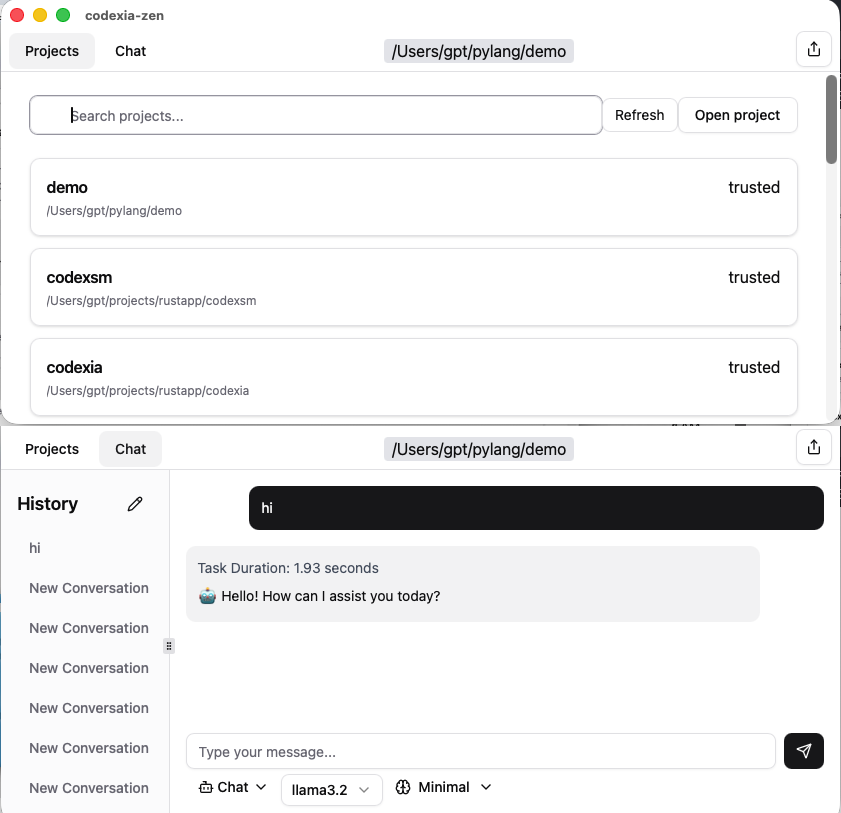

# Codexia zen

[](https://github.com/milisp/codexia-zen/stargazers)
[](http://x.com/intent/follow?screen_name=lisp_mi)

a minimalist design Tauri GUI for OpenAI Codex CLI



> [!TIP]
> **⭐ Star the repo and follow [milisp](https://github.com/milisp) on Github for more projects,[@lisp_mi](https://x.com/lisp_mi) at Twitter**.

## Related project
- [Codexia](https://github.com/milisp/codexia) - A powerful GUI and Toolkit for OpenAI Codex CLI + Claude Code
- [Codexsm](https://github.com/milisp/codexsm) - Codex cli session manager

## ✨ Features

- Cross platform Tauri GUI - Super fast
- Ask Codex to do anything
- Use your own OpenAI subscription or api

### Flexible Configuration
- Multiple AI providers (OpenAI, Ollama, Gemini, openrouter, xAI, Custom)
- One Click change mode Plan or Agent or Agent(full)
- Sandbox and Approval Policy
- Reasoning Effort

## Download

prebuild MacOS dmg

[releases](https://github.com/milisp/codexia-zen/releases)

## Build from source Prerequisites

- Tauri prerequisites: https://v2.tauri.app/start/prerequisites/

### Installation

Clone and install dependencies:
```bash
git clone https://github.com/milisp/codexia-zen
cd codexia-zen
bun install
```

Generate codex ts bindings
```sh
codex app-server generate-ts -o src/bindings
```

Run development build:
```bash
bun tauri dev
```

Build for production:
```bash
bun tauri build
```

## Quick Start

### Prerequisites
- **Codex CLI**: Install from [github Codex](https://github.com/openai/codex)
- run `codex` at terminal ensure codex work

### launch

If you use OpenAI subscription, Just launch codexia-zen then start prompt for plan or agent

### Custom other models

create a file `~/.codex/profile.json`
```json
{
  "openai": ["gpt-5.2", "gpt-5.1-codex-max", "gpt-5.1-codex", "gpt-5.1", "gpt-5.1-codex-mini"],
  "openrouter": ["openai/gpt-oss-20b:free"],
  "ollama": ["qwen2.5-coder"],
  "google": ["gemini-2.5-pro"]
}
```

config model_providers at `~/.codex/config.toml`

```toml
[model_providers.openrouter]
name = "OpenRouter"
base_url = "https://openrouter.ai/api/v1"
# env_key = "OPENROUTER_API_KEY" # use api key at `~/.codex/auth.json` instead
wire_api = "responses" # 👆 when use responses api, don't use env_key
requires_openai_auth = true # must set requires_openai_auth for openrouter

[model_providers.google]
name = "Google"
base_url = "https://generativelanguage.googleapis.com/v1beta/openai"
env_key = "GEMINI_API_KEY" # set env or export GEMINI_API_KEY=your-api-key
```

for OpenRouter or any OpenAI models `~/.codex/auth.json`
```json
{
  "OPENAI_API_KEY": "sk-mock-api-key"
}
```

## Doc

[ARCHITECTURE](docs/IMPLEMENTATION.md)
